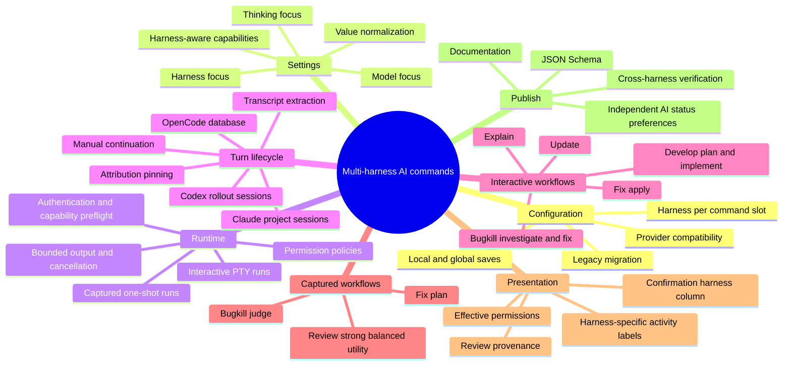

# Development Plan

## Task Description

Implement the complete multi-harness AI command experience defined in FEASIBILITY.md so all twelve AI slots can persist, configure, launch, monitor, and complete through OpenCode, Codex CLI, or Claude Code with compatible models, thinking levels, permissions, output handling, and actionable preflight errors. The work generalizes the OpenCode-specific lifecycle while preserving existing workflows, save routing, manual fallbacks, and background AI-status preferences. This is an epic cross-cutting change; splitting these sections into multiple independently delivered tasks is recommended.

**Complexity**: 20 points

---

## Overview

---

## Implementation Sections

#### Section 1 — Persisted Harness Contract ✅
**Goal**: Establish a backward-compatible, validated harness choice on every AI command slot so configuration cannot launch an incompatible executable.
**Files**: src/config/schema.rs, src/config/service.rs, tests/config.rs
**Acceptance criteria**:
- [x] Existing nested and legacy flat AI configurations without a harness deserialize every slot as OpenCode.
- [x] New configurations round-trip the explicit wire values `opencode`, `codex`, and `claudeCode` without weakening unknown-field rejection.
- [x] OpenAI models accept OpenCode or Codex, Anthropic models accept OpenCode or Claude Code, and other providers accept only OpenCode.
- [x] An incompatible hand-edited combination fails configuration loading with the affected slot path and accepted harness choices.
**Edge cases**:
- [x] Missing slots retain their existing model and thinking defaults plus OpenCode.
- [x] Empty or whitespace-only model values cannot leave a non-OpenCode harness selected.
- [x] Invalid harness values and unrelated unknown keys remain hard configuration errors.

---

#### Section 2 — Harness-Aware AI Settings ✅
**Goal**: Let users independently select model, thinking strength, and a compatible harness while preserving the established staged-save workflow.
**Files**: src/tui/screens/settings.rs, src/tui/screens/ai_model_picker.rs, src/services/opencode_models.rs, src/services/ai_models.rs, src/services/mod.rs, src/tui/app.rs, tests/tui_settings.rs, tests/opencode_models_fetch.rs
**Acceptance criteria**:
- [x] Command rows expose separate Model, Thinking, and Harness focus with the documented arrow, vim-key, Space, and Enter behavior.
- [x] Codex reasoning levels come from its bundled catalogue, Claude effort levels come from the installed CLI's advertised capabilities, and OpenCode retains its existing variant behavior.
- [x] Model selection returns only the model, preserves a supported thinking value, and otherwise resets thinking to Default.
- [x] Changing model or harness immediately resets incompatible harness or thinking values and marks only the affected row modified.
- [x] Saving a non-default harness writes the existing local configuration when present and otherwise writes global settings; Esc only stages changes.
**Edge cases**:
- [x] Selecting a free OpenCode model resets Codex or Claude Code to OpenCode.
- [x] Late capability responses for a previous harness do not overwrite the active row's choices.
- [x] Unsupported or unavailable capability discovery retains Default rather than presenting an authoritative invalid ladder.
- [x] A staged `wiseMerge` change preserves its established project-local save exception, while a harness-only change does not create a local file.

---

#### Section 3 — Provider-Neutral Execution Core ✅
**Goal**: Replace OpenCode-only launch assumptions with a common interactive and captured-run contract while preserving current OpenCode behavior.
**Files**: src/services/ai_run.rs, src/services/dashboard.rs, src/services/mod.rs, src/tui/app.rs, src/tui/widgets/pty_view.rs, src/errors.rs, src/messages.rs
**Acceptance criteria**:
- [x] Each harness receives the exact executable, canonical-model translation, prompt, effort, working directory, run mode, and planning or implementation permission policy required by its CLI.
- [x] Prompt text containing quotes, substitutions, backticks, and newlines is passed as one argument without shell interpretation.
- [x] OpenCode workflows continue to produce their existing handoffs, parsed results, and PTY behavior through the neutral contract.
- [x] Preflight distinguishes missing binary, missing authentication, unavailable model, unsupported effort, and unsupported CLI flags with the slot and harness named.
- [x] Captured runs expose bounded activity and a final transcript, support timeout and cancellation, and use collision-free capture state for concurrent worktrees.
**Edge cases**:
- [x] Claude streamed one-shot execution is rejected below version 2.1.214 without blocking supported interactive Claude use.
- [x] A non-zero exit or missing final output produces failure rather than a false successful completion.
- [x] Structured output that exceeds retention limits keeps the final transcript and only a bounded activity tail.
- [x] Selecting a command harness does not alter `dashboard.aiStatus.enabledHarnesses`.

---

#### Section 4 — Cross-Harness Turn Watchers ✅
**Goal**: Detect interactive turn completion and recover assistant transcripts from all three harnesses without attaching to stale or unrelated sessions.
**Files**: src/services/ai_turn.rs, src/services/opencode_turn.rs, src/services/ai_status.rs, src/services/ai_status/codex.rs, src/services/ai_status/claude.rs, src/services/ai_status/paths.rs, src/services/mod.rs, src/tui/app.rs
**Acceptance criteria**:
- [x] OpenCode, Codex, and Claude watchers expose equivalent working, finished-transcript, and failed outcomes plus immediate-check and partial-transcript behavior.
- [x] Codex lifecycle fixtures distinguish active, complete, and aborted turns and return only the relevant assistant response text.
- [x] Claude lifecycle fixtures distinguish tool-use continuation from terminal stop reasons and return the relevant assistant text blocks.
- [x] Each watcher excludes sessions predating spawn and pins the selected session file and identity for subsequent polls.
- [x] Existing manual continuation and PTY-exit fallbacks can recover the latest available transcript for every harness.
**Edge cases**:
- [x] Same-directory sessions created before or concurrently with the Wisetree child cannot hijack a pinned watch.
- [x] Missing, locked, partially written, or temporarily malformed session files do not freeze the UI or report premature success.
- [x] Aborted turns and explicit provider errors are failures, not clean completion.
- [x] Large session files are polled without unbounded repeated parsing or blocking terminal rendering.

---

#### Section 5 — Develop With Codex And Claude ✅
**Goal**: Deliver the first complete cross-harness interactive workflow for independently configured Develop planning and implementation phases.
**Files**: src/services/dashboard.rs, src/tui/app.rs, src/tui/screens/develop_pr.rs, src/tui/screens/settings.rs, src/messages.rs
**Acceptance criteria**:
- [x] Develop planning launches the selected harness with read-only planning permissions and advances from its recovered plan transcript.
- [x] Develop implementation launches its independently selected harness with workspace-edit permissions and continues the existing check-and-commit loop.
- [x] Codex and Claude Code become selectable for compatible Develop slots only after their complete launch, watcher, and error paths are available.
- [x] Corrective retries, forced continuation, PTY exit handling, section generations, and stale-event rejection work for all three harnesses.
**Edge cases**:
- [x] Planning with one harness and implementation with another uses each slot's own model, thinking, preflight, and watcher.
- [x] An unsupported implementation permission or failed check command does not mark the section complete.
- [x] Missing session output still permits the existing explicit manual continuation path.

---

#### Section 6 — Explain And Fix Workflows ✅
**Goal**: Route Explain and both Fix phases through their configured harnesses without changing planning, manual, or autonomous workflow semantics.
**Files**: src/services/dashboard.rs, src/tui/app.rs, src/tui/screens/explain_pr.rs, src/tui/screens/fix_pr.rs, src/messages.rs
**Acceptance criteria**:
- [x] Explain launches an interactive selected harness, tracks its completion, and retains the existing pull-request draft workflow.
- [x] Fix planning runs through the selected one-shot adapter in read-only mode and feeds the existing verdict parser the exact final transcript.
- [x] Fix apply launches the selected interactive harness with write permissions and preserves manual versus autonomous completion behavior.
- [x] Compatible Codex and Claude choices are enabled for these slots only when all phase-specific preflight, output, and failure paths are supported.
**Edge cases**:
- [x] Malformed or missing Fix plan output follows the existing corrective/error contract rather than silently applying changes.
- [x] A failed interactive child does not count as a completed Explain or Fix apply turn.
- [x] Leaving a captured phase cancels or invalidates its pending result so a late event cannot advance a different item.

---

#### Section 7 — Multi-Harness Review Pipeline ✅
**Goal**: Execute strong, balanced, and utility review roles through their independently selected one-shot harnesses with trustworthy output and provenance.
**Files**: src/services/dashboard.rs, src/services/reviewer_routing.rs, src/services/reviewer_evidence.rs, src/services/review_telemetry.rs, src/services/reviewer_tests.rs, src/tui/app.rs, src/tui/screens/review_pr.rs, src/bin/reviewer_benchmark_adapter.rs, src/bin/reviewer_benchmark.rs, src/bin/reviewer_superiority.rs, benchmarks/reviewer/preregistration.json, benchmarks/reviewer/README.md
**Acceptance criteria**:
- [x] Every strong, balanced, and utility invocation uses its role's configured harness, model, thinking level, and read-only permission policy.
- [x] Structured progress and final transcripts continue through the existing deterministic finding, verifier, reformat, and summary parsers.
- [x] Review telemetry and benchmark provenance include harness so runs from different executables are never treated as equivalent baselines.
- [x] Token usage unavailable from a harness is represented explicitly rather than inferred from OpenCode storage.
**Edge cases**:
- [x] Concurrent review calls keep output, cancellation, retries, and telemetry attributed to the correct role and file.
- [x] Malformed, truncated, timed-out, or non-zero provider output cannot create unverified findings.
- [x] Mixed-harness reviews retain independent capability and authentication failures for each role.

---

#### Section 8 — Multi-Harness Update Workflows ✅
**Goal**: Resolve pull-request, local-branch, and queued update conflicts with the configured interactive harness without risking repository state.
**Files**: src/services/dashboard.rs, src/tui/app.rs, src/tui/screens/update_pr.rs, src/tui/screens/update_branch.rs, src/messages.rs, tests/tui_update_pr.rs
**Acceptance criteria**:
- [x] PR and local-branch conflict handoffs carry a provider-neutral run specification and launch the selected harness with write permissions.
- [x] Preflight occurs before avoidable repository mutation and reports the selected Update slot's exact capability or authentication problem.
- [x] Successful watcher completion preserves existing commit, push, abort, and queue-advance behavior.
- [x] Update All tracks the selected harness across each conflict and never advances after an AI failure.
**Edge cases**:
- [x] A non-zero child exit, aborted turn, or failed watcher cannot be interpreted as resolved conflicts.
- [x] Missing transcript/session data retains a safe manual backstop without committing unresolved files.
- [x] Cancellation or switching update targets prevents stale child events from affecting the current repository.

---

#### Section 9 — Multi-Harness Bugkill Workflow ✅
**Goal**: Support configured harnesses across Bugkill investigation, fix, and judgment while retaining its hypothesis and verification state machine.
**Files**: src/services/dashboard.rs, src/services/bugkill.rs, src/tui/app.rs, src/tui/screens/bugkill_pr.rs, src/messages.rs, tests/bugkill_service.rs
**Acceptance criteria**:
- [x] Investigation launches the selected interactive harness read-only and parses its recovered transcript into ranked hypotheses.
- [x] Fix launches the independently selected interactive harness with write permissions and retains snapshot, check, and commit behavior.
- [x] Judge uses the configured one-shot harness in read-only mode and feeds its final transcript to the existing verdict parser.
- [x] Manual continue, corrective retry, and per-hypothesis progression work consistently for OpenCode, Codex, and Claude Code.
**Edge cases**:
- [x] Missing investigation output does not erase existing hypotheses and remains recoverable through the manual fallback.
- [x] A failed fix child cannot trigger snapshot comparison or commit as though implementation succeeded.
- [x] Malformed judge output follows the defined unclear/error behavior while launch and authentication failures remain actionable.

---

#### Section 10 — Presentation Documentation And Verification ✅
**Goal**: Make the selected harness and effective permissions visible throughout the product and publish a complete, tested configuration contract.
**Files**: src/tui/widgets/pr_confirm.rs, src/tui/screens/explain_pr.rs, src/tui/screens/fix_pr.rs, src/tui/screens/review_pr.rs, src/tui/screens/update_pr.rs, src/tui/screens/bugkill_pr.rs, src/tui/screens/develop_pr.rs, src/messages.rs, src/bin/generate_schema.rs, schema.json, README.md, tests/tui_widgets.rs, tests/messages.rs, tests/config.rs
**Acceptance criteria**:
- [x] Every confirmation view shows Role, Model, Thinking, and Harness from its already-resolved configuration, with effective permission policy also visible.
- [x] Activity, focus, launch, completion, and error text consistently uses OpenCode, Codex CLI, or Claude Code rather than hard-coded OpenCode wording.
- [x] Confirmation tables remain readable on narrow terminals with Model as the flexible or clipped value.
- [x] The checked-in JSON Schema covers the nested twelve-slot AI configuration, harness enum, defaults, and strict field validation.
- [x] Documentation explains provider compatibility, binaries, authentication, permissions, minimum versions, save routing, metering, and the independence of background AI status detection.
- [x] Formatting, full tests, Clippy with warnings denied, and the release build all pass.
**Edge cases**:
- [x] Legacy configurations display OpenCode in every confirmation row without requiring a rewrite first.
- [x] Long model names and Claude Code labels do not overflow or hide critical confirmation controls.
- [x] Generated schema output is reproducible and cannot silently omit Dashboard AI fields.

---

## Progress Tracker

| Section | Name | Status |
|---------|------|--------|
| 1 | Persisted Harness Contract | ✅ Done |
| 2 | Harness-Aware AI Settings | ✅ Done |
| 3 | Provider-Neutral Execution Core | ✅ Done |
| 4 | Cross-Harness Turn Watchers | ✅ Done |
| 5 | Develop With Codex And Claude | ✅ Done |
| 6 | Explain And Fix Workflows | ✅ Done |
| 7 | Multi-Harness Review Pipeline | ✅ Done |
| 8 | Multi-Harness Update Workflows | ✅ Done |
| 9 | Multi-Harness Bugkill Workflow | ✅ Done |
| 10 | Presentation Documentation And Verification | ✅ Done |

## Section Notes

- Section 1: Implemented persisted AI harnesses with compatibility validation and config tests. `cargo test --test config` passes (26 tests); `cargo test --lib` also passed (898 tests).
- Section 2: The row interaction and capability sources are now wired. I’m running formatting and a compile check next to catch signature and borrow issues introduced by the picker simplification.
- Section 3: Implemented provider-neutral AI execution; focused tests and clippy pass, while full tests have 2 unrelated Settings test failures.
- Section 4: Implemented provider-neutral pinned turn watchers for OpenCode, Codex, and Claude; focused tests, formatting, and clippy pass.
- Section 5: Focused Develop tests pass; clippy passes. Full suite has two unrelated pre-existing settings test expectation failures.
- Section 6: The handoffs now carry `AiCommand` plus harness identity; I’ve also made non-zero interactive exits fail rather than advancing Explain or autonomous Fix. Next I’m compiling to catch remaining OpenCode…
- Section 7: Implemented harness-aware review execution and provenance; focused tests/clippy pass, while full `cargo test --all` has 2 unrelated Settings test failures.
- Section 8: The core handoff is now provider-neutral and the automatic batch path is gated on verified watcher evidence. I’m compiling the focused test target now to catch exhaustive-match and borrow issues befor…
- Section 9: Implemented multi-harness Bugkill execution; tests are blocked by an existing `UpdatePrSuccess` pattern compile error in `src/tui/app.rs:6920`.
- Section 10: Implemented Section 10; focused tests and release build pass, while full tests/Clippy remain blocked by pre-existing Settings and dashboard/app warnings.
