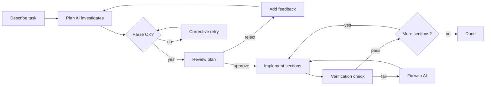

Develop PR command: plan, approve, implement section by section
<!-- wisetree-labels: user story 💬, technical debt 🛠️, architecture 🏰 -->

# Description ✍️

New AI-assisted **Develop** command on the dashboard (orange button, shortcut `D`, offered on every non-mother worktree). It decomposes a described task into implementation sections, lets the user approve/reject the plan, then realizes each section automatically in the embedded opencode TUI — all without leaving wisetree.

The pipeline is split across two AI roles:
1. **Plan** (default `openai/gpt-5.6-sol` at high thinking) — investigates the codebase read-only and emits a compact delimited plan
2. **Implement** (default `openai/gpt-5.6-terra` at medium thinking) — builds one section per run (Ralph Loop) or all pending sections at once

Includes fixes for 41 review findings from PR #84, covering: PTY exit handling, clean worktree preflight, bounded check command output, dual-model validation, async operation scoping, serialized `PLAN.md` writes, scrollable AI settings panel, and end-to-end test coverage across every preflight, handoff, and transition path. 1302 tests pass with `clippy -D warnings` clean.

# Overview 🔍

### The Develop flow at a glance

### Key features

| Feature | Detail |
|---|---|
| **Ralph Loop** | One opencode run per section with auto-advance (dashboard spinner tracks each step) |
| **Single-run mode** | One opencode run for all pending sections at once |
| **Plan approval** | Yes/No loop with freeform rejection feedback that replans |
| **Check command** | Post-section verification (Ralph-canon backpressure), e.g. `cargo test --all` |
| **Section commits** | Opt-in Ralph-canon per-section checkpoints (`git commit`) |
| **Section notes** | Each run's closing line distilled and appended to `PLAN.md` |
| **Resumable** | Existing `PLAN.md` detected on preflight — Resume, Overwrite, or Start fresh |
| **AI settings** | Two new config slots: `ai.develop.plan` and `ai.develop.implement` |

### Token-efficiency invariants

- The AI never reads or writes `PLAN.md` — the harness owns all file bookkeeping
- Each implement run receives only its section(s), never the whole plan
- The plan outline embedded in every implement prompt is a ~dozen-token-per-section roadmap (names + statuses, never bodies)
- All progress tracking, validation, file rendering, and resume detection is deterministic Rust

# How to Test 🧪

### Prerequisites

- An opencode-compatible AI model configured (`ai.develop.plan` and `ai.develop.implement`)
- A worktree with a non-mother branch checked out (e.g. a feature branch)

### Happy path

1. **Open the Develop screen** — from the Dashboard, press `D` on any non-mother worktree row (or select the orange "Develop" button)
2. **Review the Confirm page** — verify the Ralph Loop toggle (default on) and Commit sections toggle (default on) are visible and focusable with up/down arrows; Space flips each toggle
3. **Describe a task** — enter something like "Add a `--json` output flag to the dashboard command" and confirm
4. **Watch the plan AI work** — the Planning step opens an embedded opencode TUI; wait for the plan to complete
5. **Review the plan** — verify sections are listed with goals, files, acceptance criteria, and edge cases
6. **Approve the plan** — press Enter or click the checkmark button; `PLAN.md` is written to the worktree root
7. **Watch implementation** — each section runs in sequence (Ralph Loop) or all at once (single-run); a spinner shows current progress
8. **Verify output** — after completion, review the Done page showing committed section count and section notes
9. **Check the worktree** — verify uncommitted source changes exist (harness never auto-pushes)

### Edge cases and regressions

- [ ] **Plan rejection** — reject the plan, provide feedback like "the sections are too large", verify the AI replans with the feedback embedded
- [ ] **Plan parse failure** — trigger a corrective retry by providing an ambiguous task; verify the second failure surfaces an error with the transcript tail
- [ ] **Check command failure** — configure `develop.checkCommand` with a command that fails (e.g. `exit 1`); verify the CheckFailed page shows the output tail with Fix / Mark done / Pause options
- [ ] **Check timeout** — configure a long-running check command; verify the 10-minute timeout is enforced and a clean timeout message is shown
- [ ] **Resume from existing plan** — start a Develop, cancel after the first section, verify the Dashboard shows Resume / Overwrite / Start fresh options on the second attempt
- [ ] **Unparseable plan file** — write garbage to `PLAN.md` and start Develop; verify the Overwrite prompt appears
- [ ] **Dirty worktree rejection** — make an uncommitted change before starting Develop; verify the preflight rejects with a clean-worktree error
- [ ] **Missing AI configuration** — clear both `ai.develop.plan` and `ai.develop.implement` models; verify "AI not configured" toast
- [ ] **Section commits with pre-existing changes** — make changes before Develop, then run; verify section commits only include the section's new files, not pre-existing dirt
- [ ] **Section notes** — after a multi-section run, verify `PLAN.md` contains a `## Section Notes` section with one entry per completed section
- [ ] **AI Settings panel** — navigate to AI Settings; verify the two new Develop slots appear with correct labels and default models; changing one must not affect the other